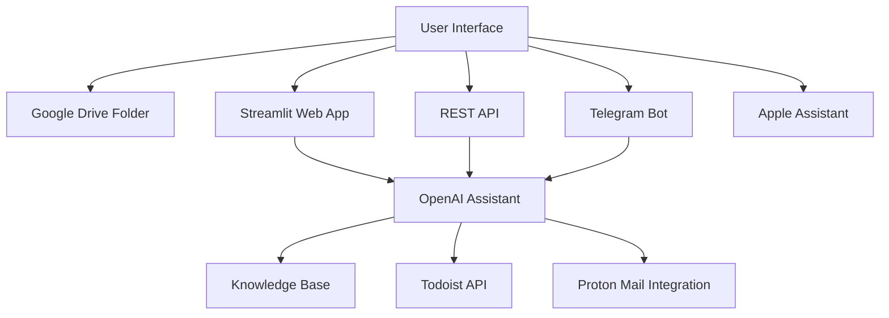

# Davide's Intelligent Personal Assistant 🤖

  

A sophisticated digital assistant leveraging cutting-edge AI to streamline personal productivity and communication. Built with modern AI infrastructure and cloud service integrations.

---

## 🌟 Key Features

### Multi-Platform Email Management
- 📩 Smart email triage with semantic search
- ✉️ Context-aware email composition
- 🗑️ Intelligent email cleanup

### Task Management Superpowers
- ✅ Todoist integration with natural language processing
- 📅 Automatic task prioritization
- 🔍 Advanced task filtering

### Cognitive Capabilities
- 🧠 Persistent conversational memory
- 📚 Personalized knowledge retrieval
- 🔄 Automated workflow orchestration

### Omnichannel Access
- 🌐 Web interface (Streamlit)
- ⚙️ REST API endpoint
- 📱 Telegram integration

---

## 🛠 Technical Architecture



### Technical Highlights

#### Core Infrastructure
- **AI Orchestration**: Leverages OpenAI's Assistant API with function calling capabilities.
- **Conversational Memory**: Thread-based context management via OpenAI's persistent threads.
- **Secure Integration**: OAuth2 and session management for Proton Mail services.

#### Intelligent Tooling
```python
# Example tool execution flow
def handle_tool_call(tool_call):
    function_map = {
        "get_emails": proton.get_emails_pure,
        "create_task": todoist.create_new_task,
        # ... other tools
    }
    return dispatch_to_service(function_map[tool_call.name], tool_call.arguments)
```

#### Design Philosophy
- **Modular Service Architecture**
  - Decoupled service integrations
  - Extensible tooling system
- **Conversation-First Interface**
  - Thread-aware interactions
  - Stateful session management
- **Security-Centric**
  - Environment variable configuration
  - Secure credential storage
  - Principle of least privilege

---

## 🚧 Current Development Focus

### Service Expansion
- 🗺 Google Maps integration for trip planning
- 📆 Calendar management solutions
- 🔍 Real-time web search capabilities

### Cognitive Enhancements
- 🔒 Long-term memory persistence
- 🎨 Preference learning system
- 🎭 Automated meeting coordination

### Infrastructure Improvements
- 🚀 Multi-provider AI model support
- ♻️ Distributed task queue system
- ⚡ Enhanced error recovery mechanisms

---

## 🌈 Vision

This project aims to create a truly intelligent digital companion that:

- Acts as a unified interface for digital services.
- Anticipates needs through behavioral patterns.
- Automates routine tasks with precision.
- Adapts to individual work styles through machine learning.

---

## 💻 Installation & Usage
[Provide detailed installation steps, including environment setup and usage instructions.]

---

## 🤝 Contribution Guidelines
We welcome contributions in these areas:
- Service integration modules
- UI/UX improvements
- Security enhancements
- Documentation translations
- Performance optimization

---

## 🔐 Security Notice
This project follows strict security practices:
- Credentials are never hardcoded.
- All external integrations use OAuth where possible.
- Regular security audits are performed.

---

> "The best tool is the one that works with you, not for you." - Project Philosophy